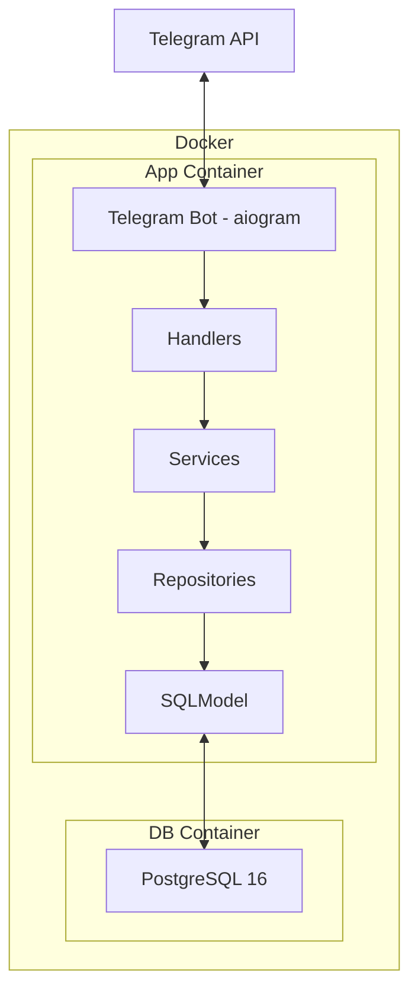
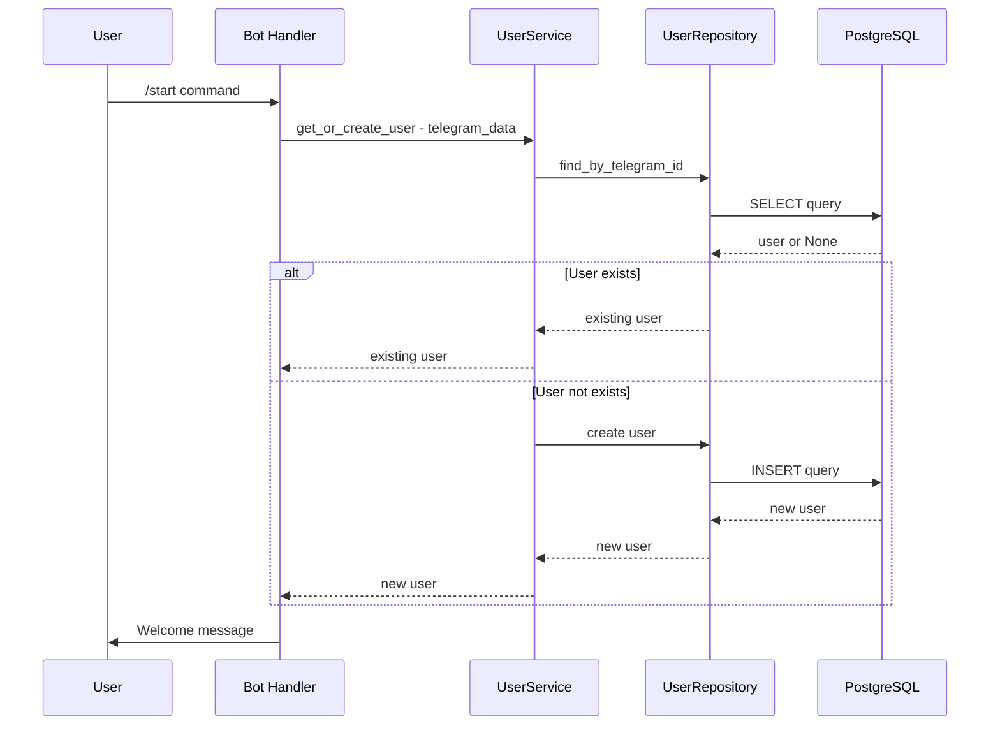

# Архитектура Telegram бота с регистрацией

## Технологический стек

| Компонент | Технология | Версия |
|-----------|------------|--------|
| Python | Python | 3.12+ |
| Telegram Bot | aiogram | 3.x |
| ORM | SQLModel | 0.0.x (на базе SQLAlchemy 2.0 + Pydantic v2) |
| База данных | PostgreSQL | 16 (последняя стабильная) |
| Миграции | Alembic | latest |
| Конфигурация | pydantic-settings | 2.x |
| Менеджер зависимостей | UV | latest |
| Контейнеризация | Docker + docker-compose | latest |

## Структура проекта

```
tg_pay_bot/
├── .kilocodeignore          # Игнорируемые файлы для KiloCode
├── .kilocoderules           # Правила проекта для KiloCode
├── .env.example             # Пример переменных окружения
├── .python-version          # Версия Python для UV
├── pyproject.toml           # Конфигурация проекта и зависимости
├── uv.lock                  # Lock-файл зависимостей
├── Dockerfile               # Docker-образ приложения
├── docker-compose.yml       # Оркестрация сервисов
├── alembic.ini              # Конфигурация Alembic
├── alembic/                 # Миграции базы данных
│   ├── env.py
│   ├── script.py.mako
│   └── versions/
├── src/
│   ├── __init__.py
│   ├── main.py              # Точка входа
│   ├── config.py            # Конфигурация (pydantic-settings)
│   ├── bot/
│   │   ├── __init__.py
│   │   └── bot.py           # Инициализация бота
│   ├── handlers/
│   │   ├── __init__.py
│   │   └── start.py         # Хендлер /start
│   ├── models/
│   │   ├── __init__.py
│   │   └── user.py          # Модель пользователя
│   ├── repositories/
│   │   ├── __init__.py
│   │   ├── base.py          # Базовый репозиторий
│   │   └── user.py          # Репозиторий пользователя
│   ├── services/
│   │   ├── __init__.py
│   │   └── user.py          # Сервис пользователя
│   └── db/
│       ├── __init__.py
│       └── session.py       # Сессия БД
└── README.md                # Документация проекта
```

## Архитектура приложения



## Поток регистрации пользователя



## Модель данных пользователя

| Поле | Тип | Описание |
|------|-----|----------|
| id | UUID | Первичный ключ |
| telegram_id | BigInteger | Уникальный ID в Telegram |
| username | String - nullable | Username в Telegram |
| first_name | String - nullable | Имя пользователя |
| last_name | String - nullable | Фамилия пользователя |
| language_code | String - nullable | Код языка |
| is_bot | Boolean | Является ли бот |
| is_premium | Boolean | Наличие Telegram Premium |
| created_at | DateTime | Дата создания |
| updated_at | DateTime | Дата обновления |

## Конфигурация через переменные окружения

| Переменная | Описание | Обязательно |
|------------|----------|-------------|
| BOT_TOKEN | Токен Telegram бота | Да |
| DATABASE_URL | URL подключения к PostgreSQL | Да |
| DB_HOST | Хост БД | Нет (по умолчанию localhost) |
| DB_PORT | Порт БД | Нет (по умолчанию 5432) |
| DB_NAME | Имя БД | Нет (по умолчанию tg_pay_bot) |
| DB_USER | Пользователь БД | Нет |
| DB_PASSWORD | Пароль БД | Нет |
| DEBUG | Режим отладки | Нет (по умолчанию false) |

## Docker Compose сервисы

### app
- Сборка из локального Dockerfile
- Зависит от db
- Переменные окружения из .env
- Том для синхронизации кода в режиме разработки

### db
- Образ: postgres:16-alpine
- Персистентные данные в volume
- Healthcheck для готовности БД

## Преимущества выбранной архитектуры

1. **Разделение ответственности**: Каждый слой отвечает за свою задачу
2. **Тестируемость**: Легко мокать слои для unit-тестов
3. **Масштабируемость**: Легко добавлять новые хендлеры, сервисы, модели
4. **Современный стек**: Асинхронность, type hints, Pydantic валидация
5. **Удобная разработка**: UV для быстрого управления зависимостями, docker-compose для изолированной среды