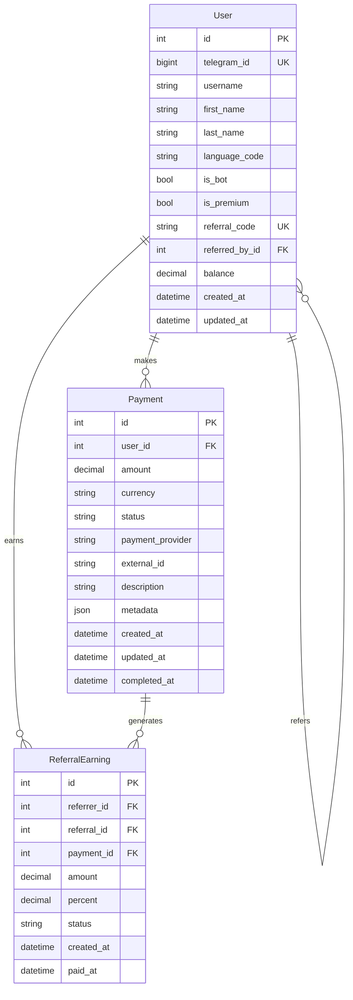
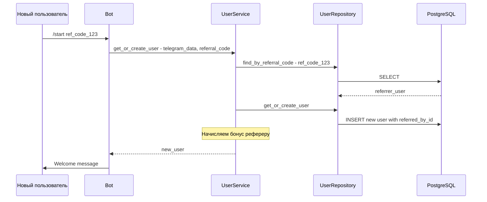
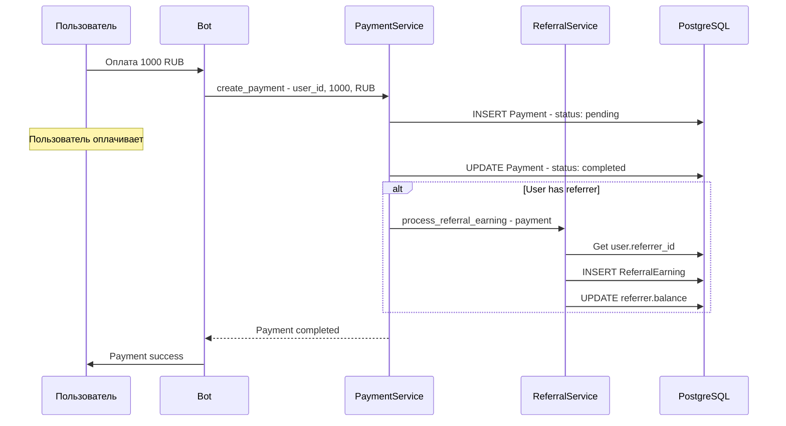

# Обновленная архитектура с платежами и рефералами

## Модели базы данных

### 1. User (Пользователь)

| Поле | Тип | Описание |
|------|-----|----------|
| id | Integer (PK) | Первичный ключ |
| telegram_id | BigInteger (Unique) | ID в Telegram |
| username | String(255) - nullable | Username в Telegram |
| first_name | String(255) - nullable | Имя |
| last_name | String(255) - nullable | Фамилия |
| language_code | String(10) - nullable | Код языка |
| is_bot | Boolean | Является ли ботом |
| is_premium | Boolean | Telegram Premium |
| referral_code | String(20) (Unique) | Уникальный реферальный код |
| referred_by_id | Integer (FK -> User) - nullable | ID реферера |
| balance | Decimal(10,2) | Баланс пользователя |
| created_at | DateTime | Дата создания |
| updated_at | DateTime | Дата обновления |

### 2. Payment (Платеж)

| Поле | Тип | Описание |
|------|-----|----------|
| id | Integer (PK) | Первичный ключ |
| user_id | Integer (FK -> User) | ID плательщика |
| amount | Decimal(10,2) | Сумма платежа |
| currency | String(3) | Валюта (RUB, USD, EUR) |
| status | Enum | pending/completed/failed/cancelled |
| payment_provider | String(50) - nullable | Провайдер оплаты |
| external_id | String(255) - nullable | ID во внешней системе |
| description | String(500) - nullable | Описание платежа |
| metadata | JSON - nullable | Дополнительные данные |
| created_at | DateTime | Дата создания |
| updated_at | DateTime | Дата обновления |
| completed_at | DateTime - nullable | Дата завершения |

### 3. ReferralEarning (Реферальный заработок)

| Поле | Тип | Описание |
|------|-----|----------|
| id | Integer (PK) | Первичный ключ |
| referrer_id | Integer (FK -> User) | ID реферера (кто пригласил) |
| referral_id | Integer (FK -> User) | ID реферала (кого пригласили) |
| payment_id | Integer (FK -> Payment) | ID платежа реферала |
| amount | Decimal(10,2) | Сумма заработка |
| percent | Decimal(5,2) | Процент от платежа |
| status | Enum | pending/paid/cancelled |
| created_at | DateTime | Дата создания |
| paid_at | DateTime - nullable | Дата выплаты |

## Диаграмма связей



## Логика работы

### Регистрация с реферальным кодом



### Обработка платежа с реферальным начислением



## Обновленная структура проекта

```
src/
├── models/
│   ├── __init__.py
│   ├── user.py           # User модель
│   ├── payment.py        # Payment модель
│   └── referral.py       # ReferralEarning модель
├── repositories/
│   ├── __init__.py
│   ├── base.py
│   ├── user.py
│   ├── payment.py        # PaymentRepository
│   └── referral.py       # ReferralEarningRepository
├── services/
│   ├── __init__.py
│   ├── user.py
│   ├── payment.py        # PaymentService
│   └── referral.py       # ReferralService
├── handlers/
│   ├── __init__.py
│   ├── start.py          # /start с реферальным кодом
│   └── payment.py        # Хендлеры платежей
└── ...
```

## Константы конфигурации

```python
# Реферальная система
REFERRAL_BONUS_PERCENT = Decimal("10.00")  # 10% от платежа реферала
REFERRAL_CODE_LENGTH = 8  # Длина реферального кода

# Валюты
SUPPORTED_CURRENCIES = ["RUB", "USD", "EUR"]
DEFAULT_CURRENCY = "RUB"
```

## Статусы

### PaymentStatus
- `pending` - ожидает оплаты
- `completed` - успешно оплачен
- `failed` - ошибка оплаты
- `cancelled` - отменен

### ReferralEarningStatus
- `pending` - ожидает выплаты
- `paid` - выплачен
- `cancelled` - отменен